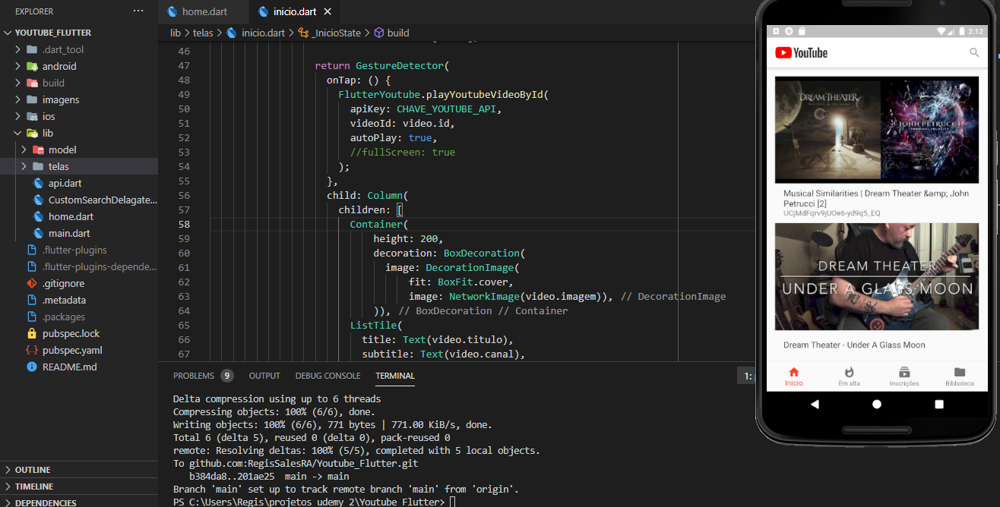

# Flutter_youtube_api

## Getting Started

Before you start make sure you have get packages
- use the command to get packages ( flutter packages get )

OBS: 
- You need create a API from https://developers.google.com/youtube/v3
- when you have genereted the key replace CHAVE_YOUTUBE_API with your key

## Now
- Flutter run

## Have fun =)

